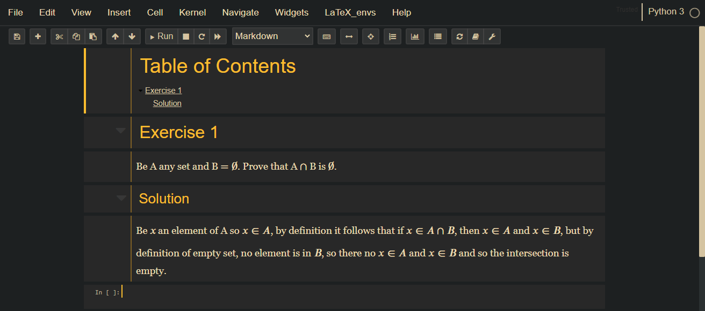

## Organización del trabajo
Vamos a trabajar en equipo.

## Posibles proyectos a desarrollar
En esta sección se discutirán los proyectos candidatos a desarrollar a lo largo del curso.

### Herramienta didáctica para demostraciones
Actualmente existen grandes herramientas para la divulgación de las matemáticas a nivel universidad; en mi caso, utilizo mayormente _LaTeX_ y _jupyter notebook_ como medio para presentar reportes, presentaciones y en general todo tipo de escritos (fig. 1). Sin embargo, el uso de estas herramientas no está optimizado para lo que es una parte fundamental del aprendizaje en las matemáticas, las demostraciones. 

Sin embargo, esta herramienta no planea competir con las antes mencionadas, sino potenciar aquellos aspectos en las que estas flojean. Para esto, se planea desarrollar un paquete o extensión que funcione dentro del mismo programa, ya sea _pandoc_, _jupyter notebooks_ o _LaTeX_. Esto cuenta con la ventaja adicional de que las extensiones son fáciles de distribuir y tienen un gran alcance, por lo que sería un gran aporte. La herramienta funcionará con _LaTeX_ y simplemente añadirá comandos a los ya existentes.

Para conseguir esto, se planea hacer uso de transiciones y animaciones que sobrescriban lo anterior, simulando una demostración en pizarrón; también focalizando los cambios respecto a el estado anterior de modo que el estudiante no se pierda en tratar de analizar cuál fue el último cambio.

###  Algoritmo para cajero automático
Buscamos una solución para el problema de dar efectivo surtido al usuario, haciendo un gasto equitativo de los billetes en el cajero. Con una simulación de cajero automático, buscar un algoritmo óptimo en el despacho de billetes, mejorando los ya existentes. El algoritmo óptimo conociste en la prioridad en el gasto de billetes equivalente en el cajero para extender el tiempo de rellenado, y la variedad satisfactoria al usuario.
